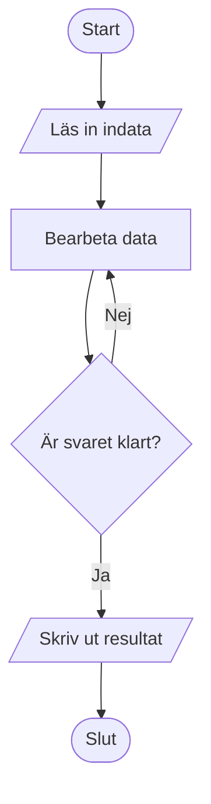
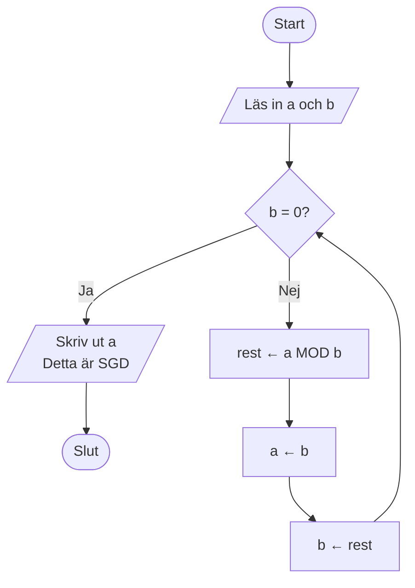
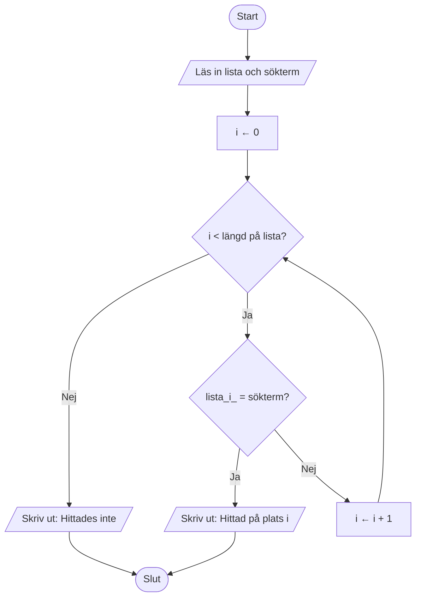
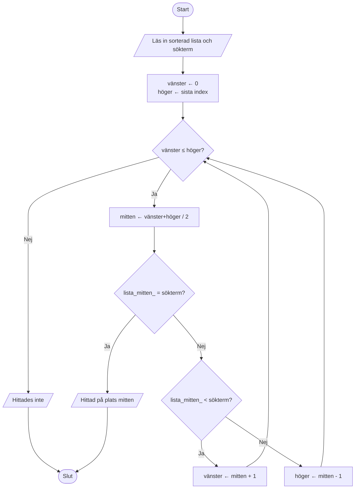

# Flödesscheman

Ett **flödesschema** (eng. *flowchart*) är ett visuellt sätt att beskriva en algoritm. Det använder standardiserade symboler:

| Symbol | Form | Betydelse |
|---|---|---|
| **Start/Slut** | Rektangel med rundade hörn | Algoritmen börjar eller slutar |
| **Process** | Rektangel | En åtgärd eller beräkning utförs |
| **Beslut** | Romb | En fråga med Ja/Nej-svar styr flödet |
| **Indata/Utdata** | Parallellogram | Läs in data eller skriv ut ett resultat |
| **Pil** | → | Visar i vilken ordning stegen utförs |

---

## Flödesschema 1 — Grundstruktur för en algoritm

---

## Flödesschema 2 — Euklides algoritm

**Läs flödesschemat:** Starta uppifrån. Vid romben frågar vi om `b = 0`. Om ja är vi klara. Om nej beräknar vi en ny rest och loopar tillbaka till frågan.

---

## Flödesschema 3 — Linjärsökning

---

## Flödesschema 4 — Binärsökning


**Tips:** Jämför flödesschemat för linjärsökning med binärsökning. Hur skiljer sig looparna åt? Varför behöver binärsökning tre beslutspunkter?

