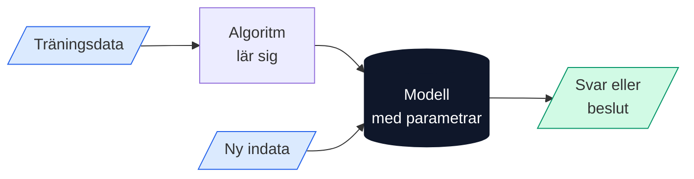

# Vardagsexempel på algoritmer

Algoritmer finns överallt — långt utanför datorn.

---

## 🍳 Recept

Ett matrecept är en klassisk algoritm. Det har:
- **Indata:** ingredienser
- **Steg:** instruktioner i ordning
- **Utdata:** den färdiga rätten

---

## 📚 Att hitta ett ord i ett lexikon

Tänk på hur du letar upp ett ord i en tryckt ordbok:

1. Öppna boken ungefär i mitten.
2. Är ordet alfabetiskt *före* sidan du är på? Titta i den vänstra halvan.
3. Är det *efter*? Titta i den högra halvan.
4. Upprepa tills du hittat ordet.

Detta är **binärsökning** — en av de viktigaste algoritmerna inom datavetenskap, men den fungerar lika bra med en pappersbok.

---

## 🚦 Trafikljus

Ett trafikljus följer en algoritm:
- Visa grönt i 45 sekunder
- Visa gult i 5 sekunder
- Visa rött i 40 sekunder
- Börja om

---

## 🃏 Sortera spelkort

Hur sorterar du ett kortspel? De flesta gör ungefär så här:
1. Ta ett kort i taget från högen.
2. Placera det på rätt ställe bland de kort du redan sorterat.

Det kallas **insättningssortering** (*insertion sort*) och är en klassisk sorteringsalgoritm.

---

## Algoritmer och AI

Inom artificiell intelligens är algoritmer grundstenen. En AI-modell är i grunden en mycket komplex algoritm som:

1. Tar **indata** (t.ex. en bild, ett textstycke, en fråga)
2. Utför **beräkningar** (miljontals matematiska operationer)
3. Ger **utdata** (ett svar, en klassificering, ett beslut)

Det som gör moderna AI-algoritmer speciella är att de kan *lära sig* — det vill säga förändra sina egna inre parametrar baserat på data, utan att människor programmerar varje enskild regel.


**Att tänka på:** Algoritmer är aldrig neutrala. De speglar de val som deras skapare gjort — och de data de tränats på. En algoritm som sorterar jobbansökningar kan vara diskriminerande om träningsdata innehöll historisk diskriminering.

