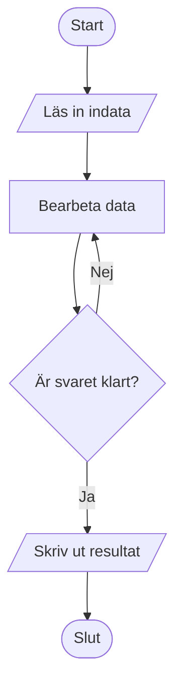
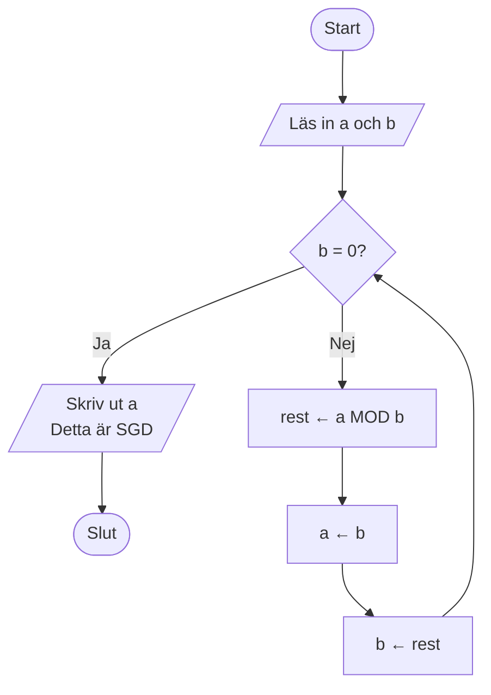
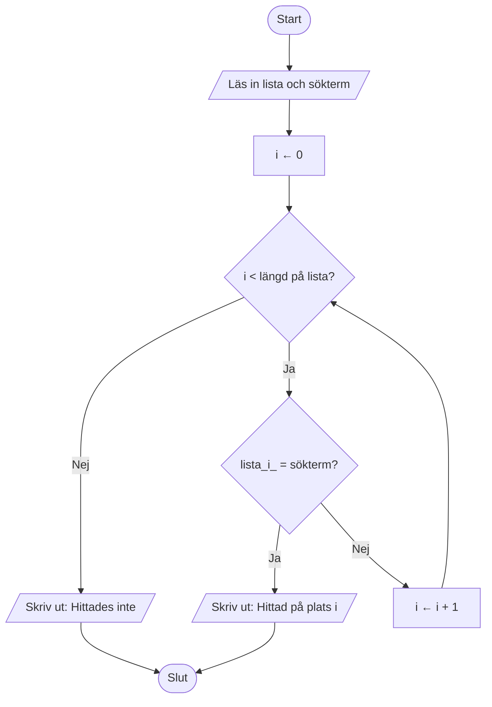
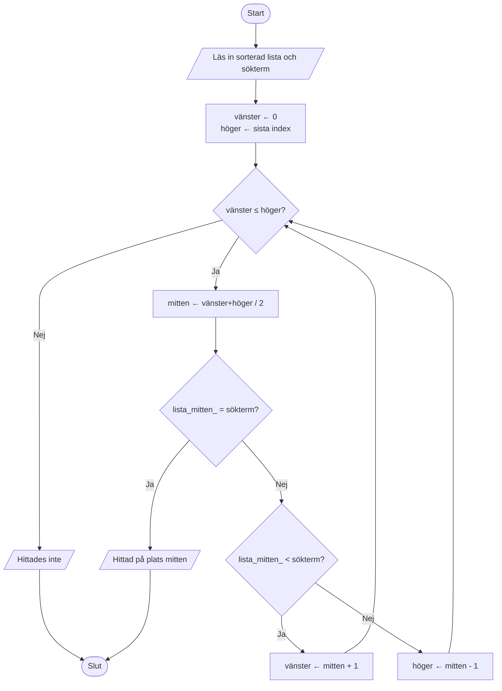
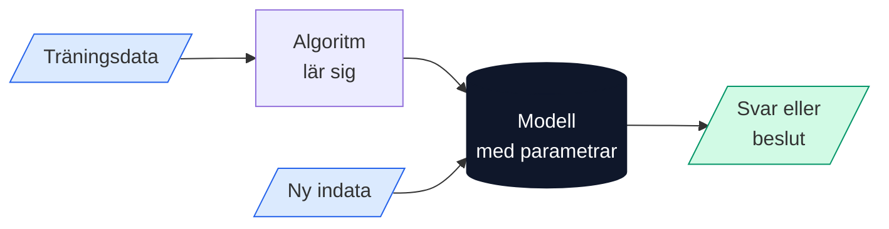

# Algoritmer

## Vad är en algoritm?

En **algoritm** är en exakt, steg-för-steg-beskrivning av hur man löser ett problem. Varje steg måste vara tydligt nog för att kunna följas utan att man behöver gissa — oavsett om det är en människa eller en dator som utför stegen.

Ordet *algoritm* kommer från namnet på den persiske matematikern **Muhammad ibn Musa al-Khwarizmi** (ca 780–850 e.Kr.), vars böcker om räknemetoder spreds till Europa och kom att kallas *algoritmi* på latin — en latinisering av hans namn.


**Kom ihåg:** En algoritm är inte ett datorprogram. En algoritm är en idé — ett recept. Ett program är ett sätt att *uttrycka* den idén i ett språk som en dator förstår.


---

## Algoritmers historia

Algoritmer är äldre än datorer — faktiskt tusentals år äldre.

### Euklides algoritm (ca 300 f.Kr.)

En av de äldsta kända algoritmerna är **Euklides algoritm** för att hitta det största gemensamma delaren (SGD) av två tal. Den beskrevs av den grekiske matematikern Euklides i verket *Elementa* och fungerar precis lika bra idag som då.

> *Hur hittar man SGD av 48 och 18?*
> 1. Dela det större talet med det mindre: 48 ÷ 18 = 2, rest 12
> 2. Ersätt det större med det mindre, och det mindre med resten: nu jobbar vi med 18 och 12
> 3. Upprepa: 18 ÷ 12 = 1, rest 6 → jobba med 12 och 6
> 4. 12 ÷ 6 = 2, rest 0 → klart! SGD = **6**

### Al-Khwarizmi och algebra (800-talet e.Kr.)

Al-Khwarizmi gav inte bara namn åt algoritmen — hans bok *Al-Kitāb al-mukhtaṣar fī ḥisāb al-jabr wal-muqābala* gav också namn åt **algebran** (al-jabr). Han beskrev systematiska metoder för att lösa ekvationer, steg för steg.

### Ada Lovelace och den första datoralgoritmen (1843)

**Ada Lovelace** anses vara världens första programmerare. Hon skrev en algoritm för Charles Babbages analytiska maskin — en mekanisk räknemaskin som aldrig byggdes klart — för att beräkna Bernoullis tal. Det är den första algoritmen som var avsedd att köras på en maskin.

### Moderna algoritmer

Med datorernas intåg på 1900-talet exploderade algoritmforskningen. Idag styr algoritmer allt från hur din mobilkamera fokuserar till hur sociala medier väljer vad du ser i ditt flöde.

---

## Vad skiljer en algoritm från ett program?

Det är en viktig och vanlig fråga. Enkelt uttryckt:

| | **Algoritm** | **Program** |
|---|---|---|
| **Vad är det?** | En idé eller metod | En konkret implementation |
| **Språk** | Vanlig svenska, pseudokod, flödesschema | Python, Java, C++, … |
| **Kör på dator?** | Inte nödvändigtvis | Ja |
| **Exempel** | "Sortera listan från minst till störst" | `list.sort()` i Python |

Ett **recept** är ett bra exempel på en algoritm som inte är ett program: det beskriver exakt vad du ska göra, i vilken ordning, men det körs av en människa — inte en dator.

---

## Vad kännetecknar en bra algoritm?

En algoritm måste uppfylla tre krav:

1. **Ändlighet** — Den måste ta slut. En algoritm som aldrig slutar är inte användbar.
2. **Entydighet** — Varje steg måste vara tydligt. "Blanda lite" duger inte — "blanda i 2 minuter" är bättre.
3. **Korrekthet** — Den måste ge rätt svar för alla giltiga indata.

---

## Pseudokod

**Pseudokod** är ett sätt att beskriva en algoritm i en form som liknar programkod, men som är skriven för att vara lättläst för människor — inte för datorer. Det finns inget standardiserat pseudokodspråk; man väljer ord och struktur som gör algoritmen tydlig.

Pseudokod är ett viktigt mellansteg: man kan designa och diskutera en algoritm i pseudokod *innan* man väljer vilket programspråk man ska implementera den i.


**Pseudokod används för att:** tänka igenom en lösning, kommunicera en algoritm till andra, och dokumentera logiken oberoende av programspråk.


### Grundläggande byggstenar i pseudokod

De flesta algoritmer byggs av tre grundläggande konstruktioner:

| Konstruktion | Beskrivning | Exempel |
|---|---|---|
| **Sekvens** | Steg utförs ett i taget, i ordning | `läs in tal` → `beräkna` → `skriv ut svar` |
| **Villkor** | Ett steg utförs bara om ett villkor är sant | `OM tal > 0 DÅ skriv "positivt"` |
| **Upprepning** | Ett block av steg upprepas | `MEDAN rest ≠ 0 GÖR ...` |

### Exempel 1 — Hitta det störta talet i en lista

```
ALGORITM HittaStörst(lista)
  störst ← lista[0]
  FÖR VARJE tal I lista GÖR
    OM tal > störst DÅ
      störst ← tal
    SLUT OM
  SLUT FÖR
  RETURNERA störst
SLUT ALGORITM
```

**Förklaring:** Vi börjar med att anta att det första elementet är störst. Sedan jämför vi varje element i listan med vår nuvarande kandidat. Om vi hittar något större, uppdaterar vi kandidaten. Till slut returnerar vi svaret.

### Exempel 2 — Euklides algoritm i pseudokod

```
ALGORITM SGD(a, b)
  MEDAN b ≠ 0 GÖR
    rest ← a MOD b     (rest vid heltalsdivision)
    a ← b
    b ← rest
  SLUT MEDAN
  RETURNERA a
SLUT ALGORITM
```

**Exempel:** `SGD(48, 18)` → rest = 12 → `SGD(18, 12)` → rest = 6 → `SGD(12, 6)` → rest = 0 → **returnerar 6**

### Exempel 3 — Linjärsökning

Linjärsökning är den enklaste sökalgoritmen: gå igenom listan från början till slut tills du hittar det du söker.

```
ALGORITM LinjärSökning(lista, sökterm)
  FÖR i ← 0 TILL längd(lista) - 1 GÖR
    OM lista[i] = sökterm DÅ
      RETURNERA i          (positionen där vi hittade den)
    SLUT OM
  SLUT FÖR
  RETURNERA -1             (-1 betyder "hittades inte")
SLUT ALGORITM
```

### Exempel 4 — Binärsökning

Binärsökning fungerar bara på en *sorterad* lista, men är mycket snabbare: den halverar sökområdet vid varje steg.

```
ALGORITM BinärSökning(lista, sökterm)
  vänster ← 0
  höger  ← längd(lista) - 1

  MEDAN vänster ≤ höger GÖR
    mitten ← (vänster + höger) / 2  (heltalsdivision)

    OM lista[mitten] = sökterm DÅ
      RETURNERA mitten
    ANNARS OM lista[mitten] < sökterm DÅ
      vänster ← mitten + 1           (sök i högra halvan)
    ANNARS
      höger ← mitten - 1             (sök i vänstra halvan)
    SLUT OM
  SLUT MEDAN

  RETURNERA -1
SLUT ALGORITM
```


**Jämförelse:** För en lista med 1 000 element behöver linjärsökning i värsta fall **1 000 jämförelser**. Binärsökning behöver bara **10**. Det är skillnaden mellan O(n) och O(log n) — ett viktigt begrepp inom algoritmlära.


---

## Flödesscheman

Ett **flödesschema** (eng. *flowchart*) är ett visuellt sätt att beskriva en algoritm. Det använder standardiserade symboler:

| Symbol | Form | Betydelse |
|---|---|---|
| **Start/Slut** | Rektangel med rundade hörn | Algoritmen börjar eller slutar |
| **Process** | Rektangel | En åtgärd eller beräkning utförs |
| **Beslut** | Romb | En fråga med Ja/Nej-svar styr flödet |
| **Indata/Utdata** | Parallellogram | Läs in data eller skriv ut ett resultat |
| **Pil** | → | Visar i vilken ordning stegen utförs |

### Flödesschema 1 — Grundstruktur för en algoritm



### Flödesschema 2 — Euklides algoritm



**Läs flödesschemat:** Starta uppifrån. Vid romben frågar vi om `b = 0`. Om ja är vi klara. Om nej beräknar vi en ny rest och loopar tillbaka till frågan.

### Flödesschema 3 — Linjärsökning



### Flödesschema 4 — Binärsökning




**Tips:** Jämför flödesschemat för linjärsökning med binärsökning. Hur skiljer sig looparna åt? Varför behöver binärsökning tre beslutspunkter?


---

## Vardagsexempel på algoritmer

Algoritmer finns överallt — långt utanför datorn.

### 🍳 Recept

Ett matrecept är en klassisk algoritm. Det har:
- **Indata:** ingredienser
- **Steg:** instruktioner i ordning
- **Utdata:** den färdiga rätten

### 📚 Att hitta ett ord i ett lexikon

Tänk på hur du letar upp ett ord i en tryckt ordbok:

1. Öppna boken ungefär i mitten.
2. Är ordet alfabetiskt *före* sidan du är på? Titta i den vänstra halvan.
3. Är det *efter*? Titta i den högra halvan.
4. Upprepa tills du hittat ordet.

Detta är **binärsökning** — en av de viktigaste algoritmerna inom datavetenskap, men den fungerar lika bra med en pappersbok.

### 🚦 Trafikljus

Ett trafikljus följer en algoritm:
- Visa grönt i 45 sekunder
- Visa gult i 5 sekunder
- Visa rött i 40 sekunder
- Börja om

### 🃏 Sortera spelkort

Hur sorterar du ett kortspel? De flesta gör ungefär så här:
1. Ta ett kort i taget från högen.
2. Placera det på rätt ställe bland de kort du redan sorterat.

Det kallas **insättningssortering** (*insertion sort*) och är en klassisk sorteringsalgoritm.

---

## Algoritmer och AI

Inom artificiell intelligens är algoritmer grundstenen. En AI-modell är i grunden en mycket komplex algoritm som:

1. Tar **indata** (t.ex. en bild, ett textstycke, en fråga)
2. Utför **beräkningar** (miljontals matematiska operationer)
3. Ger **utdata** (ett svar, en klassificering, ett beslut)

Det som gör moderna AI-algoritmer speciella är att de kan *lära sig* — det vill säga förändra sina egna inre parametrar baserat på data, utan att människor programmerar varje enskild regel.




**Att tänka på:** Algoritmer är aldrig neutrala. De speglar de val som deras skapare gjort — och de data de tränats på. En algoritm som sorterar jobbansökningar kan vara diskriminerande om träningsdata innehöll historisk diskriminering.


---

## Övningar

### Övning 1 — Hitta algoritmen i vardagen

Välj *ett* av följande och beskriv det som en algoritm med minst fem tydliga steg. Tänk på att varje steg ska vara så exakt att en person som aldrig gjort det förut kan följa det.

- Borsta tänderna
- Betala med Swish
- Ta bussen från skolan hem
- Göra en kopp te

> **Diskutera:** Vad händer om ett steg är otydligt? Kan ni komma på ett steg i er algoritm som är för vagt?

---

### Övning 2 — Algoritm eller program?

Bestäm om följande är en **algoritm**, ett **program**, eller **båda**:

1. En IKEA-monteringsanvisning
2. Källkoden till Instagram
3. Metoden att räkna ut ett medelvärde
4. Kalkylator-appen på din telefon
5. En karta och en beskrivning av en resväg

---

### Övning 3 — Felsök algoritmen

Nedanstående algoritm ska beskriva hur man gör en smörgås. Den har **tre fel** — hitta dem och rätta till.

```
1. Ta fram brödet.
2. Bred på smör.
3. Ät smörgåsen.
4. Lägg på pålägg.
5. Lägg ihop brödskivorna.
```

> **Fundera:** Vilken typ av fel är det — handlar det om ordning, om att steg saknas, eller om otydlighet?

---

### Övning 4 — Designa en algoritm

En kompis ska hitta ett specifikt ord i en 300-sidig ordbok, men får bara slå upp sidor — inte bläddra fritt.

1. Beskriv en algoritm som löser problemet.
2. Hur många uppslag behöver ni *som mest* om ni använder er bästa metod?
3. Jämför med en annan grupp — fick ni samma algoritm?

> **Tips:** Tänk på lexikonet-exemplet ovan.

---

### Övning 5 — Pseudokod

Skriv pseudokod för en algoritm som:
1. Läser in tre tal.
2. Räknar ut medelvärdet.
3. Skriver ut om medelvärdet är positivt, negativt eller noll.

> **Utmaning:** Rita sedan ett flödesschema för samma algoritm. Stämmer de överens?

---

### Övning 6 — Tolka ett flödesschema

Titta på flödesschemat för linjärsökning ovan. Vad händer om:
- Söktermen **finns** på plats 0 i listan?
- Söktermen **inte finns** i listan alls?
- Listan är **tom** (har noll element)?

Följ flödesschemat steg för steg för vart och ett av fallen.

---

### Övning 7 — Reflektion (skriftlig)

Besvara följande i 3–5 meningar:

> *Algoritmer styr allt från vad du ser på TikTok till om du beviljas ett banklån. Vem bär ansvaret när en algoritm fattar ett felaktigt eller orättvist beslut — programmeraren, företaget, eller användaren? Motivera ditt svar.*

---

## Sammanfattning

- En **algoritm** är en exakt, steg-för-steg-metod för att lösa ett problem.
- Algoritmer är **äldre än datorer** — de finns i matematik, recept och vardagliga rutiner.
- Skillnaden mot ett **program** är att ett program är en konkret implementation av en algoritm i ett datorspråk.
- En bra algoritm är **ändlig**, **entydig** och **korrekt**.
- **Pseudokod** är ett läsbart sätt att beskriva en algoritm utan att binda sig till ett programspråk.
- **Flödesscheman** visualiserar algoritmens logik med symboler för sekvens, beslut och upprepning.
- Inom AI är algoritmer centrala — och de bär med sig de val och värderingar som deras skapare byggt in.

---

*Nästa kapitel: Maskininlärning — när algoritmer lär sig av data*
